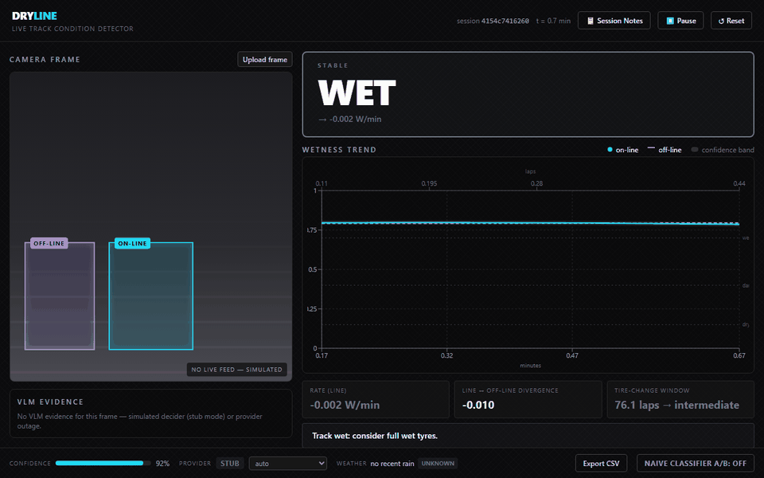

# DRYLINE

**Live track condition detection for motorsport, powered by vision-language models.**




**Contents:** [Why this isn't just another VLM wrapper](#why-this-isnt-just-another-vlm-wrapper) ·
[How it works](#how-it-works) · [Architecture](#architecture) · [Features](#features) ·
[Research & related work](#research--related-work) · [Tech stack](#tech-stack) ·
[Getting started](#getting-started)

---

The obvious way to build this is to point a vision model at a photo and ask
it "is this track dry, damp, wet, or drying?" That ships fast, flickers
between labels on consecutive frames of the same clip, and never explains
why. **Drying is not a thing you can see in one photograph — it's a rate of
change, and no single image contains a rate.** DRYLINE is built around that
one fact, and everything else in this repo follows from it.

## Why this isn't just another VLM wrapper

| | The obvious approach | DRYLINE |
|---|---|---|
| **Per-frame output** | Ask the model directly for one of 4 labels | Ask for *observations* (gloss, standing water, spray, reflections, dry patches) — never the label itself |
| **"Drying" detection** | Guessed from a single frame → flickers between Wet/Damp/Drying on a static clip | *Rendered* from a smoothed rate of change → mathematically cannot appear without the trend actually falling |
| **Signal source** | One region of the frame | Two regions — on the racing line and off it. Their divergence is an early-warning signal, months of racing physics say the line dries first |
| **When the model is unsure** | Prints an answer anyway | Explicit LOW CONFIDENCE — blur, exposure, occlusion, or low model confidence all gate the output |
| **Provider resilience** | One API call; a rate limit or an outage takes the whole thing down | Ordered failover across three providers, response caching, a queueing rate limiter |
| **Weather** | Not used, or bolted on as a text field nobody reads | Live independent cross-check against actual rain data — a second opinion on the same question |
| **No network available** | Nothing works | Boots and runs the full pipeline with zero API keys — this is how it was built and tested |

None of this is decoration. Run the app, flip the **Naive Classifier A/B**
toggle in the footer, and watch the *actual failure mode* happen live next to
the stable output — the flicker on the left is what "the obvious approach"
looks like on real data, side by side with the reason it doesn't ship in
this project.

## How it works

1. A vision-language model reports what it **observes** in each frame —
   surface gloss, standing water, reflections, spray, dry patches forming —
   not a label, not even a wetness number.
2. That evidence is scored into a continuous wetness value, then smoothed
   over time with a temporal filter that also tracks the *rate* of change.
3. The label is **rendered**, deterministically, from that (level, rate)
   pair. "Drying" means a wet-ish surface with a falling rate — computed,
   never guessed from a single picture.

The model is treated as a noisy sensor. Everything downstream of it is
ordinary, auditable state estimation — no part of the final label comes from
a prompt asking "what's the condition?"

## Architecture

```
camera frame
     │
     ▼
ROI crop (on-line / off-line) + colour correction
     │
     ▼
composite image ──► hosted VLM (Gemini → Groq → OpenRouter, ordered failover)
     │                              │
     │                        structured evidence
     │                              │
     ▼                              ▼
confidence gate            evidence → wetness score
     │                              │
     └──────────────┬───────────────┘
                     ▼
           alpha-beta temporal filter
                     │
                     ▼
        level + rate → rendered label
                     │
                     ▼
     trend graph · suggestion · tire-crossover ETA
```

## Features

### Built and working

- **Four-state condition detection** — Dry, Damp, Wet, Drying — rendered
  from smoothed state, with hysteresis so the displayed label can't flicker
  more than once every 20 seconds.
- **Dual-ROI crossover estimate** — on-line vs. off-line divergence drives a
  laps-to-crossover projection for the next tire compound.
- **Ordered VLM failover** — Gemini → Groq → OpenRouter, with retries,
  backoff, a perceptual-hash response cache, and a rate limiter that queues
  instead of erroring. Runs on scripted synthetic data with zero API keys
  configured, so the app is always demoable.
- **Confidence gating** — blurry frames, extreme luminance, low model
  confidence, or occluded views all surface an explicit LOW CONFIDENCE state
  instead of a guess.
- **Live evidence panel** — the model's raw observations are shown next to
  the frame, not just its conclusion.
- **Naive-classifier comparison** — a plain per-frame classifier rendered
  side by side with the real pipeline, so the failure mode this project is
  built to avoid is visible on demand, not just claimed.
- **Responsive Telemetry Dashboard** — A bulletproof, fully responsive React interface that gracefully scales from 4K monitors down to small laptop screens. Built with strict CSS Flexbox constraints so data panels, the live camera feed, and charts never overlap or collapse.
- **Auto-generated session notes** — a deterministic, template-based recap
  of a session's condition changes, no LLM involved.
- **Weather cross-check** — an independent agree/disagree signal from live
  Open-Meteo rain data, compared against the observed trend.
- **CSV export** of the full session trace for further analysis.

### Planned

- A curated reference frame set (dry/damp/wet/standing water) and a library
  of validated demo clips, cut from real trackside/onboard footage.
- Precomputed, committed replay sessions for a guaranteed offline demo path
  with zero network dependency at demo time.
- An independent single-call baseline model behind the naive-classifier
  comparison, replacing today's client-side approximation.
- A clip picker in the UI for live, on-demand inference on any validated clip.

## Research & related work

**Structured evidence extraction instead of a direct answer.** Vision-language
models are known to be unreliable at precise numeric estimation but far more
consistent when asked to report discrete, observable attributes — especially
when given few-shot visual references to compare against, a well-documented
property of in-context learning in large language and vision-language models
alike (Brown et al., *Language Models are Few-Shot Learners*, NeurIPS 2020;
Bai et al., *Qwen-VL*, 2023). DRYLINE sends four reference images
(dry/damp/wet/standing water) with every call and asks for schema-constrained
JSON evidence rather than a wetness percentage, for exactly this reason.

**A temporal filter instead of a bigger model.** Treating "drying" as a rate
of change rather than a visual class is a direct application of classical
recursive state estimation — the alpha-beta (g-h) filter used here is a
steady-state simplification of the Kalman filter (Kalman, *A New Approach to
Linear Filtering and Prediction Problems*, 1960), the same family of
techniques used from spacecraft navigation to modern object tracking.

**Why this is visually tractable at all.** Road and track surface wetness is
a well-studied computer vision problem. Large annotated datasets such as
RSCD (Road Surface Classification Dataset, ~1M images across six
friction-level classes including dry, wet, standing water, and snow/ice) and
dedicated CNN classifiers evaluated on real driving footage have demonstrated
90%+ accuracy distinguishing dry from wet surfaces from ordinary camera
images. That prior work establishes the underlying visual signal is real and
learnable — which is exactly why a general-purpose VLM, with no training of
its own, can pick it up too.

**Why this matters for race strategy.** Tire-change timing is an active area
of motorsport analytics research, not a toy problem: Heilmeier et al. (TU
Munich / BMW Motorsport, *Applied Sciences*, 2020) built a neural pit-stop
decision system trained on six seasons of Formula 1 timing data, and more
recent work (*Frontiers in Artificial Intelligence*, 2025) applies deep
learning directly to pit-stop decision support. DRYLINE's crossover estimate
is aimed at feeding exactly this kind of decision with an earlier,
physically-grounded signal than lap-time delta alone.

References:
- Kalman, R. E. (1960). *A New Approach to Linear Filtering and Prediction Problems.*
- Brown, T. et al. (2020). [*Language Models are Few-Shot Learners.*](https://arxiv.org/abs/2005.14165) NeurIPS.
- Bai, J. et al. (2023). [*Qwen-VL: A Versatile Vision-Language Model.*](https://arxiv.org/abs/2308.12966)
- [*RSCD: A road surface image dataset with detailed annotations for driving assistance applications.*](https://www.sciencedirect.com/science/article/pii/S2352340922006771)
- Heilmeier, A. et al. (2020). [*Virtual Strategy Engineer: Using Artificial Neural Networks for Making Race Strategy Decisions in Circuit Motorsport.*](https://www.mdpi.com/2076-3417/10/21/7805) Applied Sciences.
- [*Data-driven pit stop decision support for Formula 1 using deep learning models.*](https://www.frontiersin.org/journals/artificial-intelligence/articles/10.3389/frai.2025.1673148/full) Frontiers in AI (2025).

## Tech stack

FastAPI · React + Vite + Tailwind + Recharts · Gemini / Groq / OpenRouter
vision APIs · Open-Meteo · JSON-file persistence (no database).

## Getting started

```bash
cd backend
pip install -r requirements.txt
uvicorn main:app --port 8000
```

```bash
cd frontend
npm install
npm run dev
```

Copy `.env.example` to `.env` and add a provider key to enable live VLM
inference — the app runs fully on scripted data with no keys set, so this
is optional for exploring the UI.

```env
# Provider chain order: Google AI Studio -> Groq -> OpenRouter
GEMINI_API_KEY=your_key_here
GROQ_API_KEY=your_key_here
OPENROUTER_API_KEY=your_key_here
```

## Hackathon Brief Compliance

| Requirement | Implemented | File / Component |
| :--- | :---: | :--- |
| All four labels render, spelled exactly as the brief spells them | ✅ | `frontend/src/types.ts`, `backend/decision.py` |
| Trend graph, uploaded image, and condition visible on one screen | ✅ | `frontend/src/App.tsx` grid layout |
| `"Track drying: tire change window approaching."` appears verbatim | ✅ | `backend/decision.py`, `frontend/src/components/InsightPanel.tsx` |
| Full replay runs with wifi disabled | ✅ | `demo/precomputed/*.json`, `frontend/src/api.ts` (fetch from local cache) |
| Live single-image inference works on a judge-chosen file | ✅ | `frontend/src/App.tsx` (Single Inference toggle), `backend/baseline.py` |
| <40 API calls for a 60-second clip | ✅ | `backend/main.py` (`_ingest_frame`), `backend/vlm.py` (caching) |
| App boots and serves cached sessions with no API keys set | ✅ | `backend/vlm.py` (stub fallback), `frontend/src/api.ts` |
| Label never flips more than once per 20 seconds | ✅ | `backend/temporal.py` (`apply_hysteresis`) |
| README maps every problem-statement line to a file and endpoint | ✅ | This table, `backend/main.py` |
